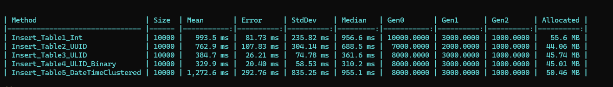
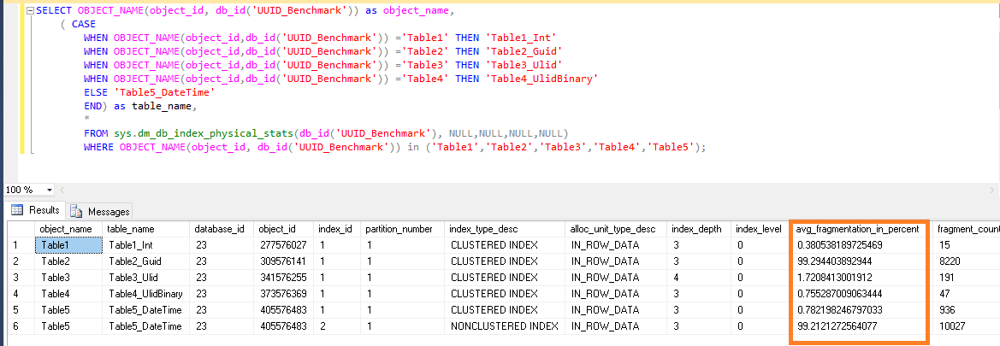
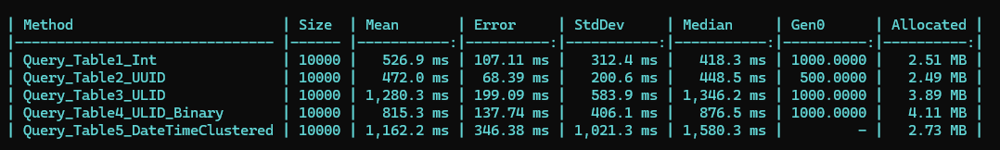

```bash
> dotnet ef migrations add initial
> dotnet ef database update
> dotnet run -configuration Release
# another option
> dotnet run -c Release
# build in Release Mode
> dotnet build -c Release
# publish in Release Mode
> dotnet publish -c Release
```

**Insert Benchmark**


**Index Fragmentation in Sql Server**


**Query Benchmark**
