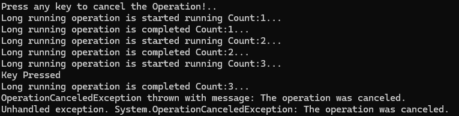

## Console App with Cancellation Token Example

**Without Cancellation Token**
- The Process will continue until it finishes all the work.
  

**With Cancellation Token**
- Create a CancellationToken Source Token
- Pass the token to the long processing method and check if the cancellation is called.
- Press a key to create a cancel method on CancellationToken Source.
- In this way, even we press anykey the process will continue until it finishes the particular step before it cancel.
- Here the key was pressed on start of cycle 3, the process stoped after it completes the cycle 3.

**Cancellation Token pass to Task.Delay also**
