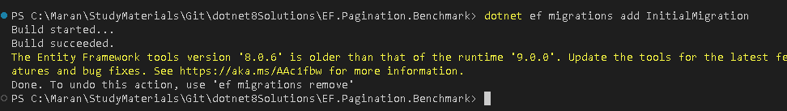
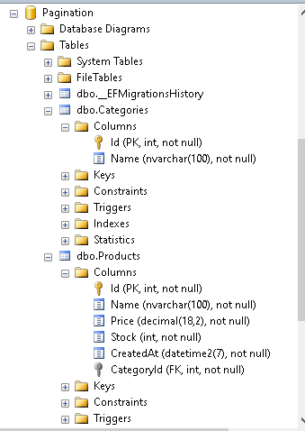
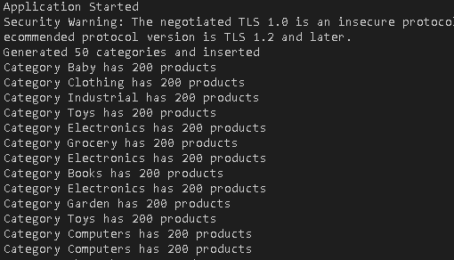
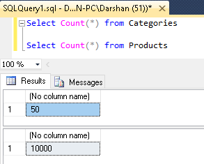

dotnet ef migrations add intialmigration

dotnet ef database update










**Execution:**
```bash
dotnet run --configuration Release
dotnet run -c Release
# to build in Release Mode
dotnet build -c Release
# to publish in Release Mode
dotnet publish -c Release
```
**Benchmark Results**


**SQL Server Query Execution and Plans**


- Enable the Query Execution plan in the SQL server and execute the query.

**Query 1:**

  

  

  

**Query 2:**


**Query 3:**


**Pagination Techniques**

- **Offset-based Pagination**:
    
    - In this approach we use skip() to skip a number of records based on the current page and .Take() to fetch a fixed number of records.
    - For example, for page number 2 and page size of 10, Skip((pageNumber-1)* pageSize) will skip 10 records and Take(pageSize) will take the next 10 records.
-  **Cursor-based Pagination**:
  
   - In cursor based pagination, we query for records greater than the last known ProductId (the cursor), which allows continuous navigation without the potential issues of offset pagination when records change between requests
   - This pagination technique is useful for large datasets, where offset-based pagination might become inefficient due to recalculating offsets.  
   - This approach drawback is that you can't switch to desired page in the pagination.
   - Diffcult to use when you have various sorting and filtering opttions.
   - Good usecases are, Useful in places like Real-time data like Social media timelines where you can implement infinite scrolling.


