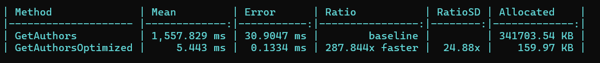
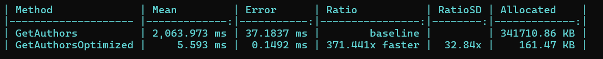
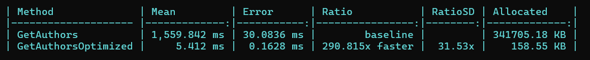
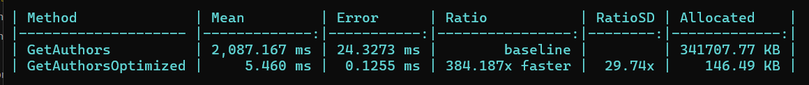
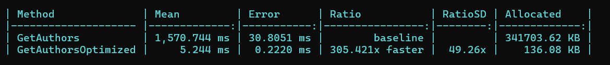
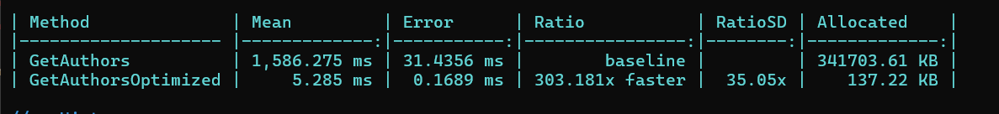
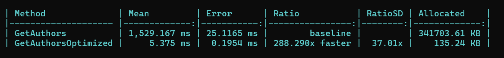
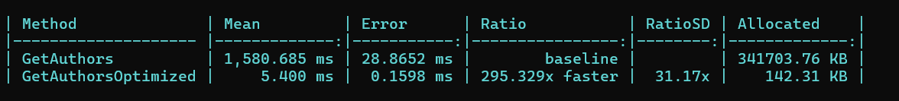
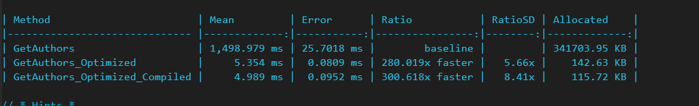

## Optimize EFCore Query Performance

**Steps Performed in the Optimized Query method**:
1. Remove the ToList() method in the Authors. This ToList() will bring all of the records from the database and 
   then perform select based on the condidtion/select following.
2. Remove the ToList() before the Where condition.

**Perform the Benchmark**:
```bash
> dotnet run -c release
```


**Percentage faster**: 287.844x faster

**Take away**: Never load all the records, load only required records from the database.

3. After fetching Authors, we are doing order by desc and fetch top 2 records. This can be combined with the previous fetch process where condition.  - Remove OrderByDescending and .Take(2) and apply in authors where condition.



**Percentage faster**: 371.441x faster

**Takeaway**: Apply the condition directly in the database, instead of fetching all and then apply the condition. In this case fetching top 2 authors.

4. While fetching AllBooks in the author query, we don't have any where condition applied and we are using ToList(). This will bring all the records in books table. Later we are applying the condition to fetch the book's published year less than 1900. 
 - Move the where condition where we are selecting all the books.

 

 **Percentage faster**: 290.815x faster. 

 There is a performance degradation, but lets keep the query as same way and have the heavy lifting in the database, instead of fetching and applying condition.

 5. Now select only required fields for the output, instead of returing too much or unncessary columns from the database.



 **Percentage faster**: 384.187x faster

 **Takeaway**: include only the required columns in the select query instead specifying all or do * from.

 6. Remove the unncessary includes in the query.

 

**Percentage faster**: 305.421x faster

We can apply NoTracking in the dbContext, but here we are projecting the results to a DTO instead of an entity, applying the NoTracking will not bring much difference. Here is with NoTracking()



7. We are returing the books count to use just for the Order by descending. Move the orderby statement above and remove the field.



**Percentage faster**: 288.298x faster


8. Apply the Filter Includes. In our case, apply the book year condition in the Filter Includes and remove the condition in the AllBooks


**Percentage faster**: 295.329x faster

## Further consideration
1. Create a index on Authors table for the columns Country and Age. In books table create an index for Year column.

## Using Compiled Queries


**Percentage faster**: 300.618x faster