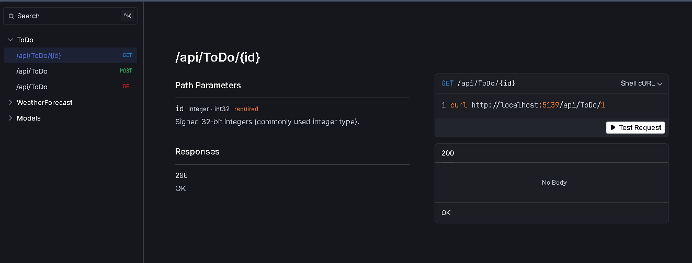
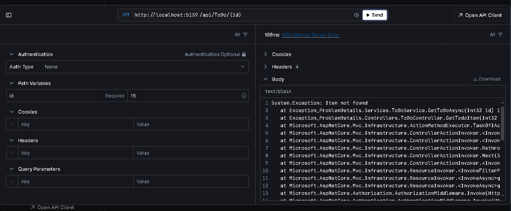
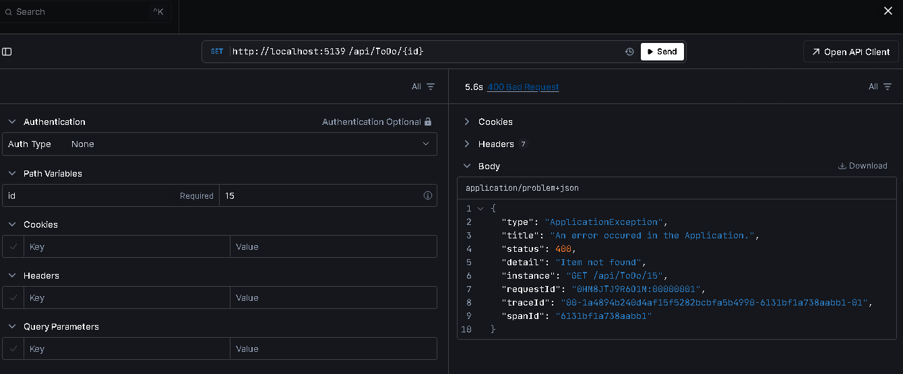

## Implementing ProblemDetails response on Handling exceptions and errors

- Standardize the errors from the API.
- We can use ProblemDetails Json Object

**Example Api Endpoints**

**Without Exception Handling**:

**With ProblemDetails handling**:

