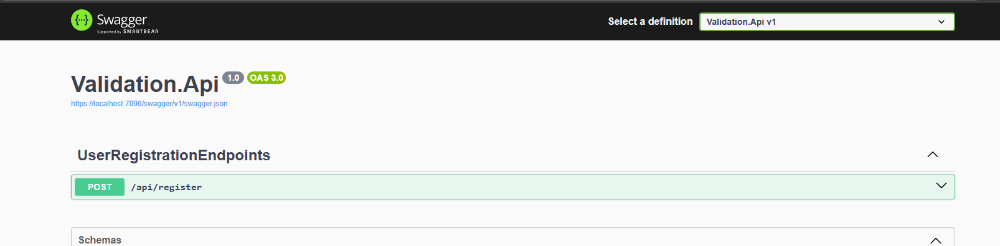
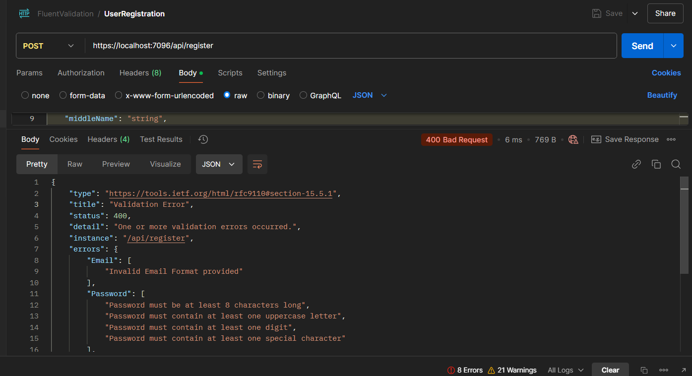
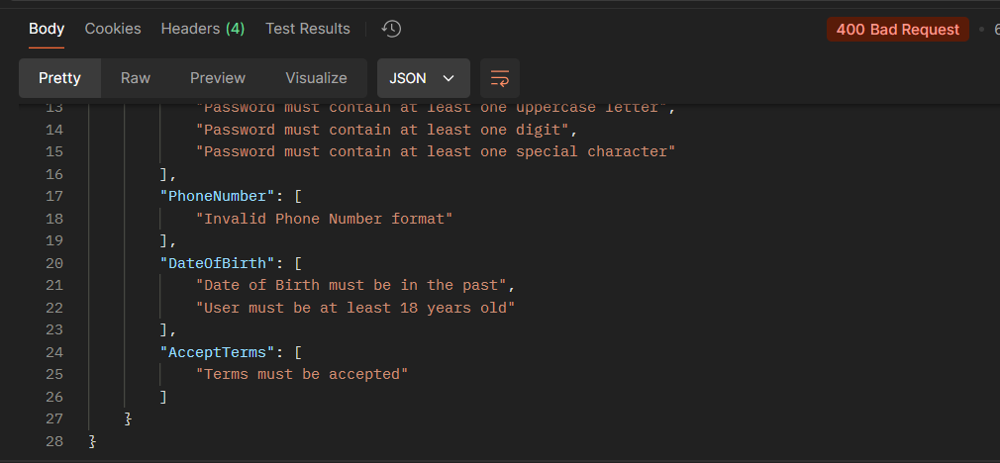

# Using FluentValidation to validate appSettings on startup and validate the models

 - Validate the appSettings setting On app Startup
 - Validate the models when sending the request
 - Used CarterModule to register the MinimalApi Endpoints

