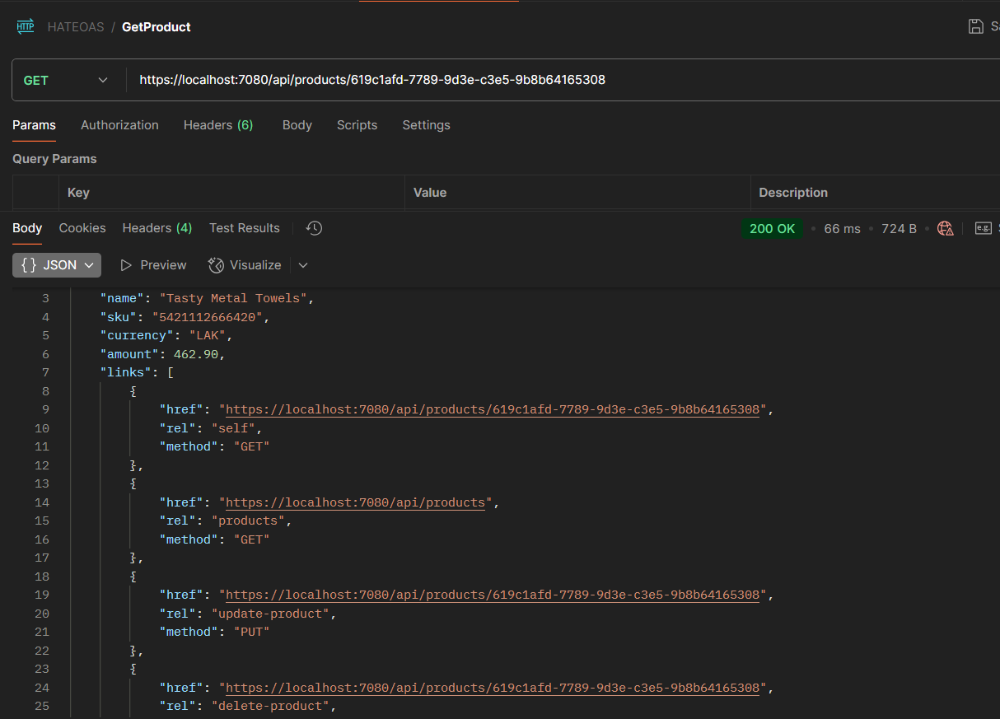
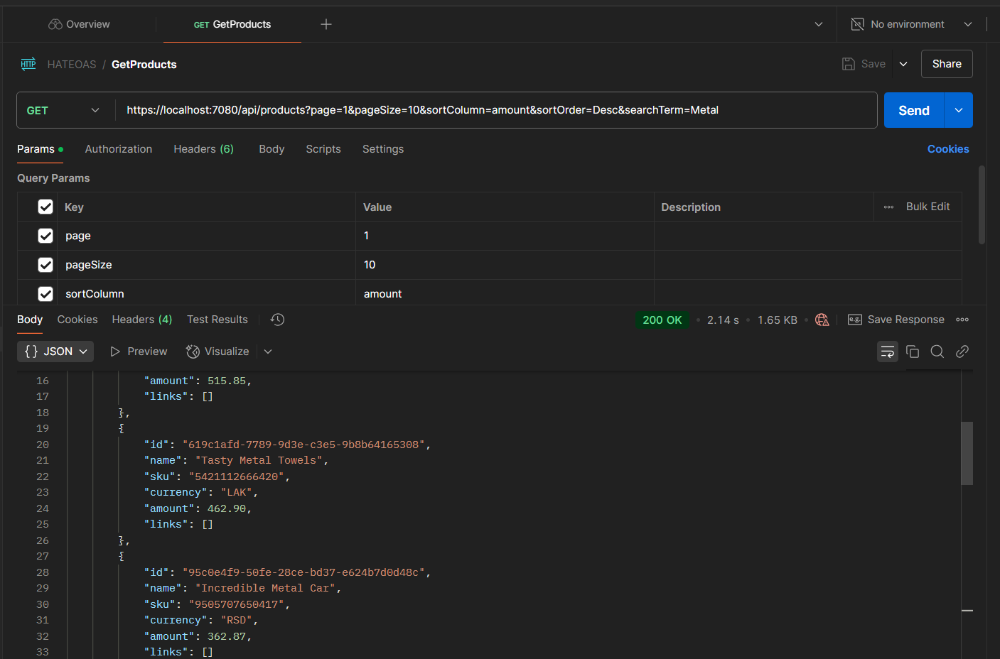
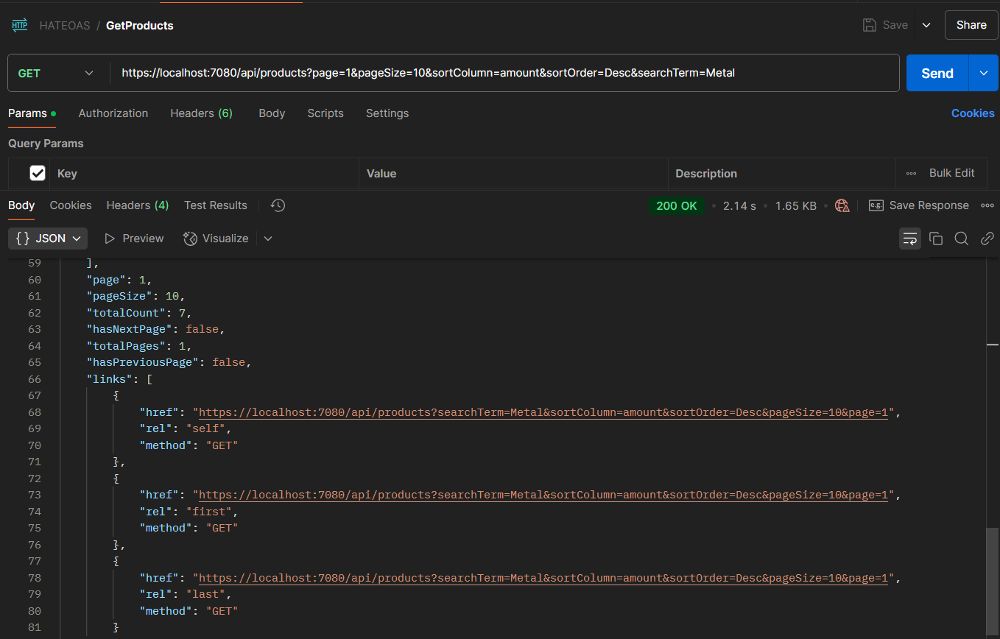

# Implementing HATEOAS in .Net Web Api REST Architecture

- HATEOAS - Hypermedia as the Engine of Application State
- Its a constraint of REST application architecture, enabling a client to dynamically navigate resources in an appliation by following hyperlinks embedded in the responses from the server. 

- **GetProduct**:



- **GetProducts**:





- Sample JSON:
```json
{
    "page": 2,
    "pageSize": 10,
    "totalCount": 50,
    "hasNextPage": true,
    "totalPages": 5,
    "hasPreviousPage": true,
    "links": [
        {
            "href": "https://localhost:7080/api/products?sortColumn=amount&pageSize=10&page=2",
            "rel": "self",
            "method": "GET"
        },
        {
            "href": "https://localhost:7080/api/products?sortColumn=amount&pageSize=10&page=1",
            "rel": "first",
            "method": "GET"
        },
        {
            "href": "https://localhost:7080/api/products?sortColumn=amount&pageSize=10&page=3",
            "rel": "next-page",
            "method": "GET"
        },
        {
            "href": "https://localhost:7080/api/products?sortColumn=amount&pageSize=10&page=1",
            "rel": "previous-page",
            "method": "GET"
        },
        {
            "href": "https://localhost:7080/api/products?sortColumn=amount&pageSize=10&page=5",
            "rel": "last",
            "method": "GET"
        }
    ]
}
```