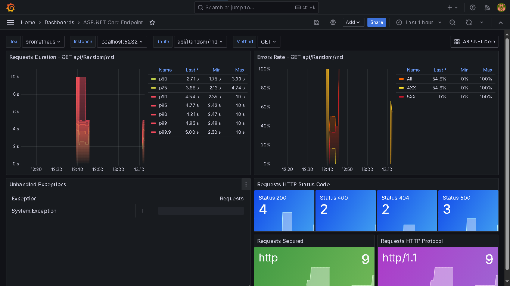
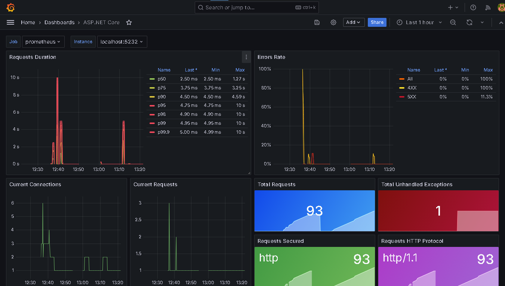
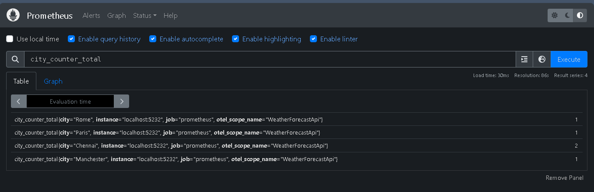

# Metrics Visualization using Prometheus and Grafana

### Asp.Net Core Endpoint Dashboard

### Asp.Net Core

## Prometheus

# Instructions
  - we can use Prometheus and grafana using Docker. Here I have used standalone installation.
  - Download Prometheus and extract the binary package
  - Update the Prometheus.yaml file and include the URL of the .Net web api to scrap the metrics. 
  - Specify the interval on which the metrics needs to be scarped
  - Used the below dashboard to visualize the .net web api metrics
    - 