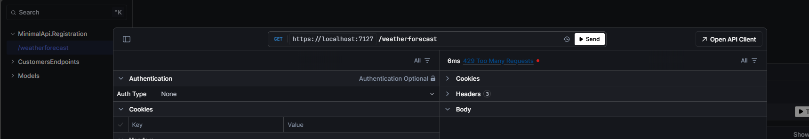

# Registering Minimal API and Apply RateLimit based on IP Address
 - For Registering the Minimal API, used the package MinimalApis.Discovery

 ```xml
 <PackageReference Include="Microsoft.AspNetCore.OpenApi" Version="9.0.0" />
 ```

 - Added the Fixed Window RateLimiting using RateLimiter. The RateLimiting is based on the IP Address
 - This Rate Limiting is applied to the Minimal API endpoint using RequireRateLimiting("<policyname>")
 - In this example restricted the limit to max 5 request in 10 sec. After that the user will get 429 error and the user needs to wait for the 10 seconds to cross to send the next set of request(s).

