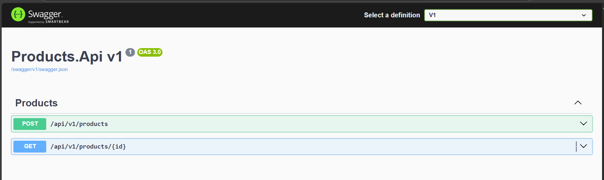
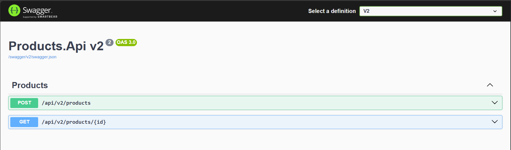
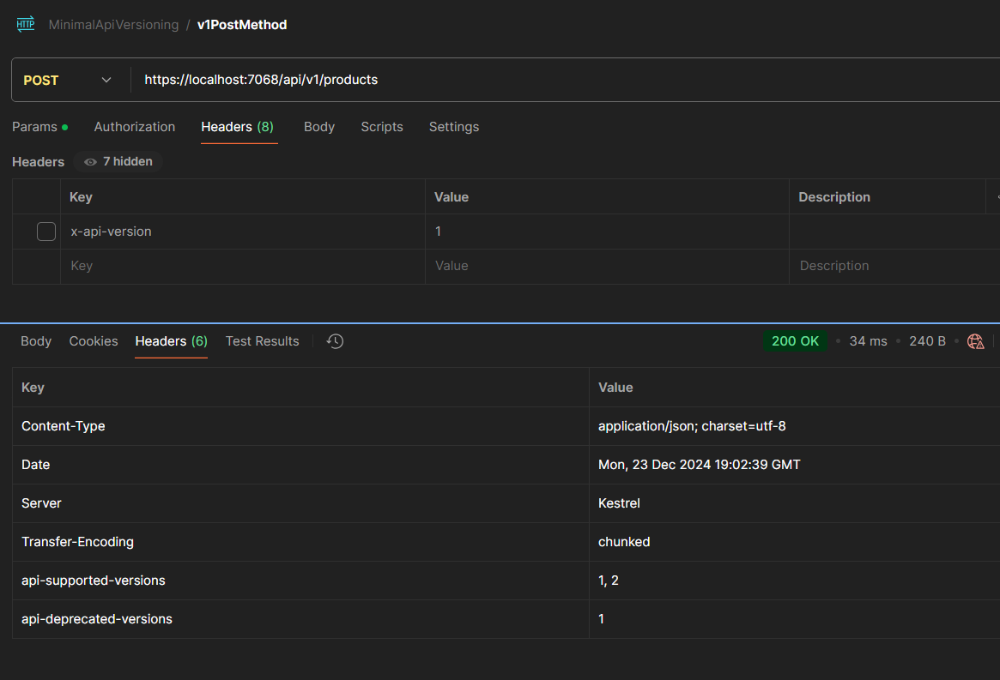

# API Versioning in Minimal API
  - Setup Versioning for the minimal API endpoints

## Packages to be installed.
 - Asp.Versioning.Http
 - Asp.Versioning.Mvc.ApiExplorer ( Needed for Swagger Documentation update)
 - Asp.Versioning.Mvc (For Controllers Applications) 

