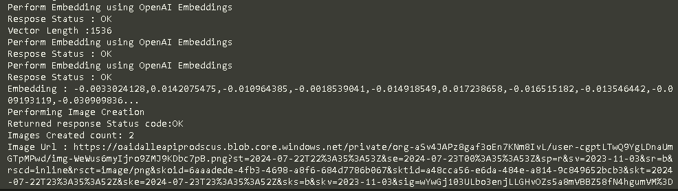

# Using ConnectingApps.Refit.OpenAI 
Using ConnectingApps.Refit.OpenAI nuget package, we can interact with OpenAI Api for Chat completion, Image generation and Text embeddings.

In this example, tried Image creation and text embeddings

```bash
# Create a new Console Project
> dotnet new console -o Openai.consoleapp

# Add the project to existing Solution
> dotnet sln .\dotnet8Solutions.sln add .\Openai.consoleapp\Openai.consoleapp.csproj

# add user Secret 
> dotnet user-secrets init
# add pacakge to support user secrets
> dotnet add package Microsoft.Extensions.Configuration.UserSecrets
# add the OpenAI key in user secrets
> dotnet user-secrets set "OpenAI_Key" "sk-XXXXXXXXXXXXXXXXXXXXXXXXXXXXXX"
# add package reference for ConnectionApp.Refit.OpenAI
> dotnet add package ConnectingApp.Refit.OpenAI --version 1.9.0
# build the project
> dotnet build
#run the Project
> dot net run
```

### Output
