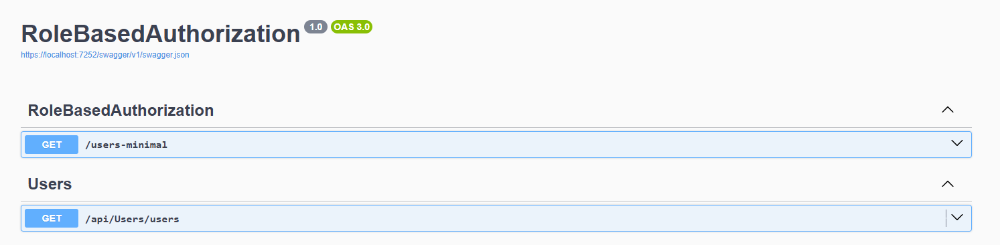
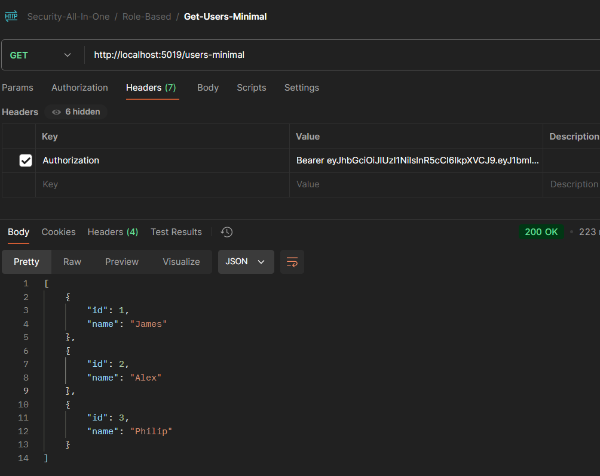

## Role Based Access Control (RBAC) in .Net Core application

**Nuget Package needs to add**:
Microsoft.AspNetCore.Authentication.JwtBearer


```bash
> dotnet user-jwts create
```

Other Commands
```
\\ To clear the JWTs created
> dotnet user-jwts clear

\\ To list the JWTs created
> dotnet user-jwts list

\\ Create jwt with specific claims
> dotnet user-jwts create --audience "http://localhost:5019" --issuer "dotnet-user-jwts"

\\ to check the development certificates installed
> dotnet dev-certs https --trust

> dotnet user-jwts create --role Admin

> dotnet user-jwts create --role Admin --audience "https://localhost:7234"

> dotnet user-jwts create --claim user-group=WEB


```



**Note**: 
When using dotnet user-jwts create, it will create some configuration in the user secrets secrets.json file and appSettings.Development.json. This will not add SigningKeys in the appSettings.Development.json file. So when running the application with the valid Jwt token, you may get the below error.

WWW-Authenticate: Bearer error="invalid_token", error_description="The signature key was not found"

To fix this, add an appSettings value for SigningKeys with an empty array. 

```json
"Authentication": {
  "Schemes": {
    "Bearer": {
      "ValidAudiences": [
        "http://localhost:5019",
        "https://localhost:7252"
      ],
      "ValidIssuer": "dotnet-user-jwts",
      "SigningKeys": [
        
      ]
    }
  }
}
```

