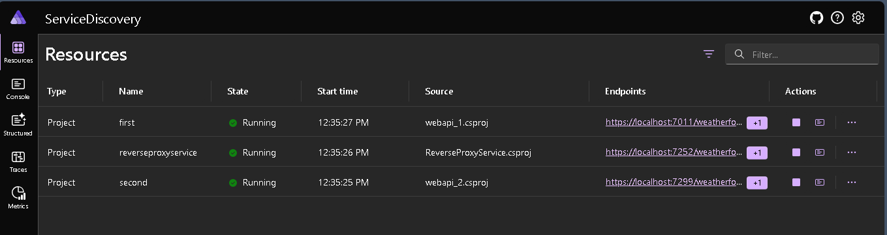
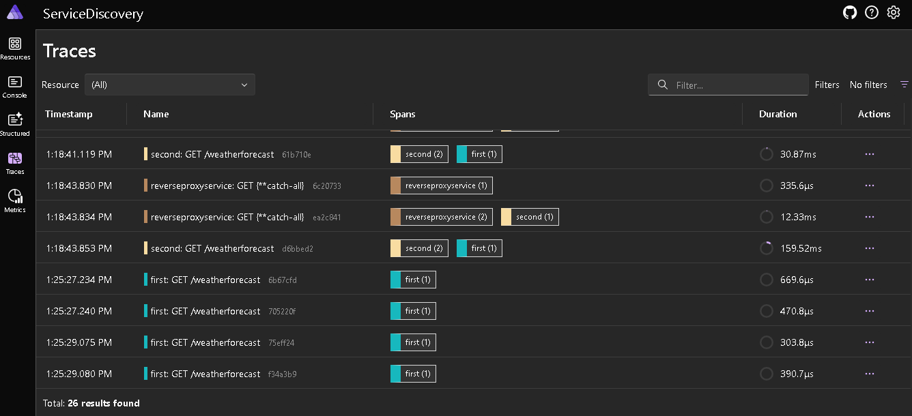
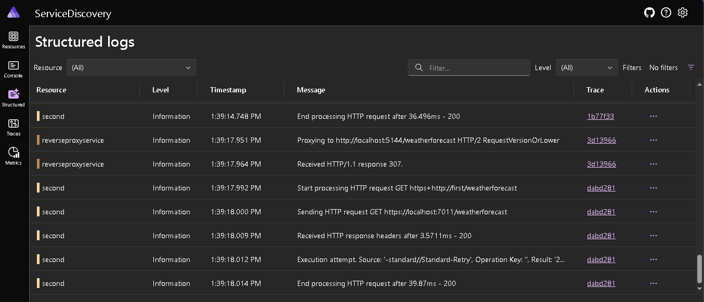
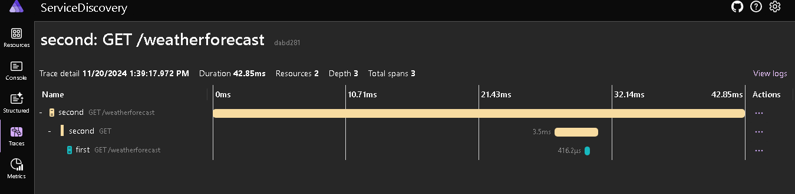

## Service Discovery
 - Use Service Discovery in microservices  
 - Use Service Discovery in Reverse Proxy
  
**webapi_1**: Default Weather Forecast API

**webapi_2**: Using HttpClient to call Webapi_1

**ReverseProxy**: Uses Yarp Revese Proxy and have the route to webapi_2

**Added Orchestration support using .Net Aspire**

**.Net Aspire Dashboard**:

