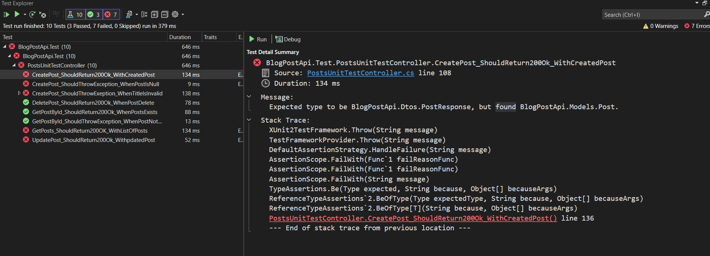
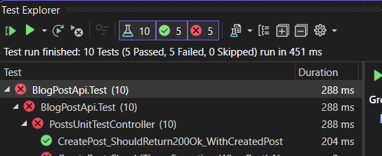
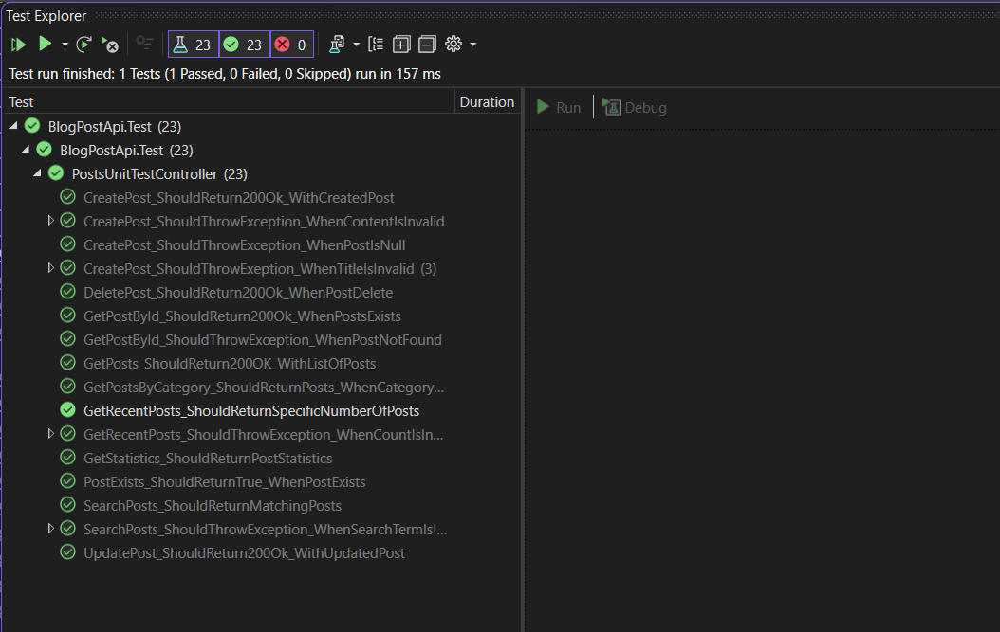

Here are the test results for some of my test cases

Lets fix one by one for the errors.
1. CreatePost should return 200Ok
  - In the test case I expected PostReponse as output, but in the code I have returned Post object. Fixing the reponse object will pass this testcase.

  

  Final Result

  