# Webhooks system in .Net using Postgres in .Net Aspire

## Create Subscription with Webhook Url
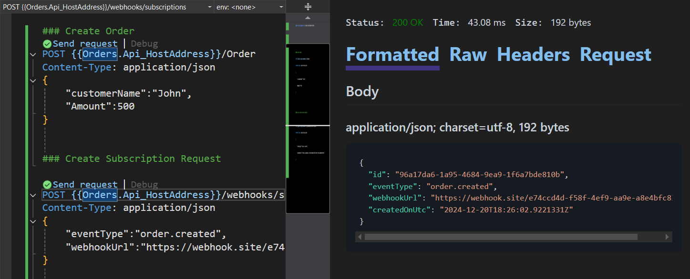

## Create Order

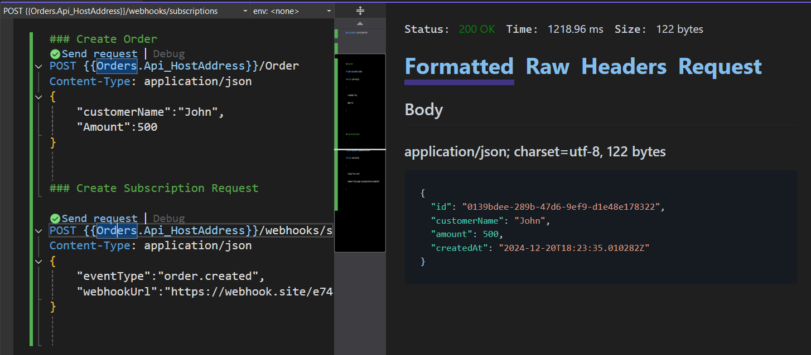

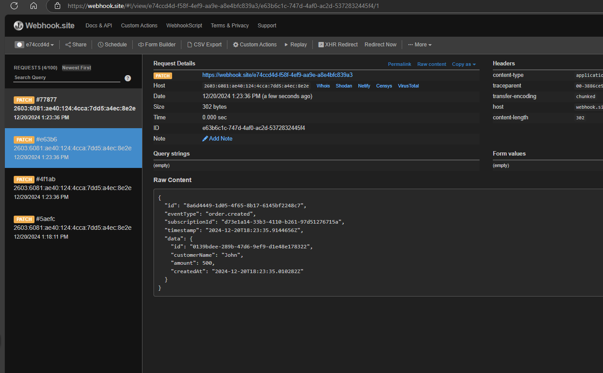

## Adding Persistance storage using Postgres 

**.Net Aspire Resources**
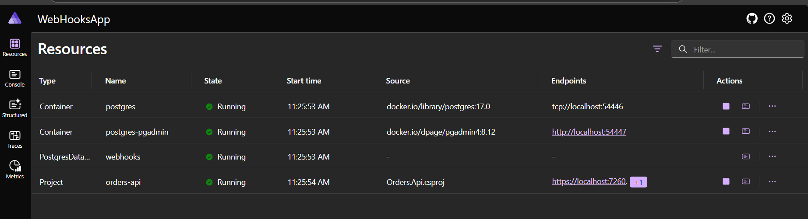

**Created tables with Schema**

- Access the PgAdmin tool using the resource in .Net Aspire

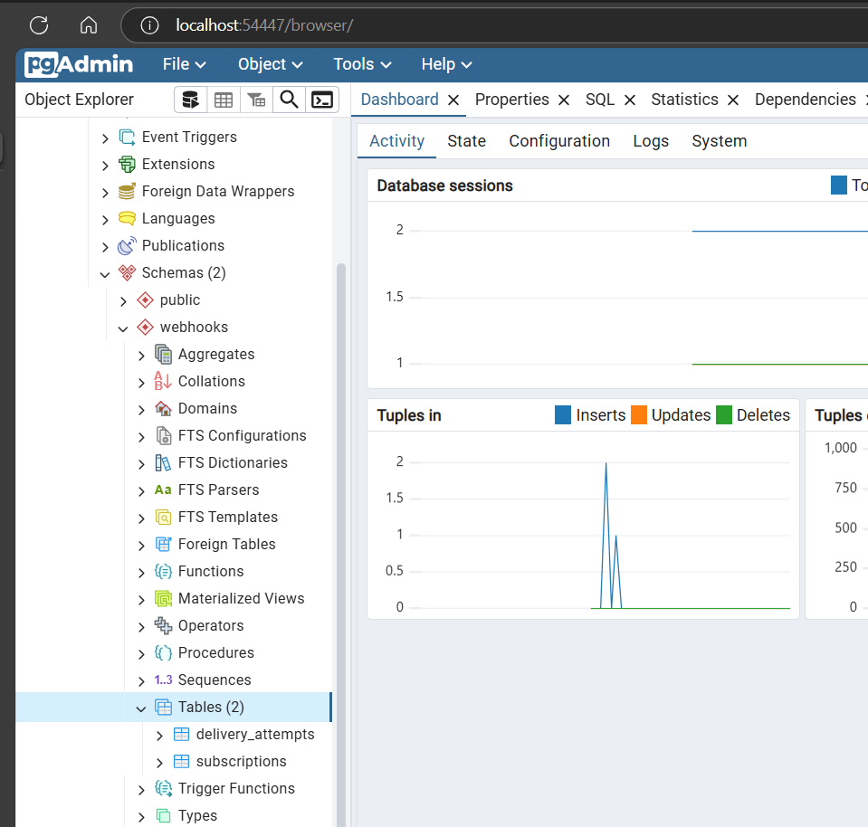

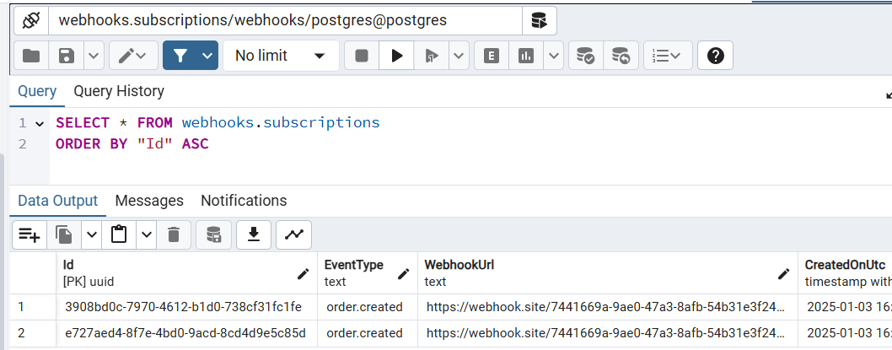

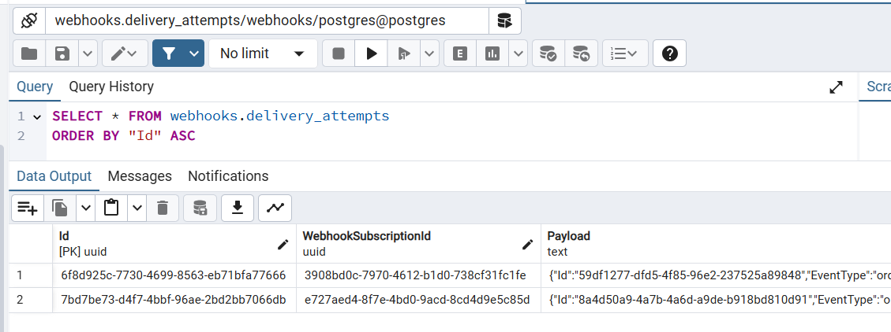

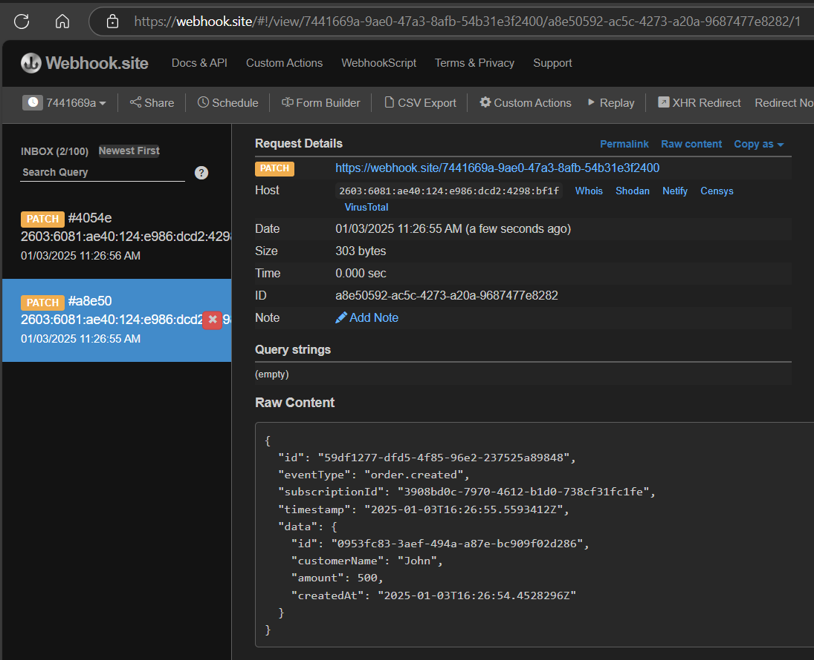

## Performance Issue if there is more number of subscriptions for the same event type.

- Here for creating a single order, the system is trying to trigger the web hook for all the subscriptions.
- As we are processing all the subscriptions one by one on a single Order Post request, it will delay the response.

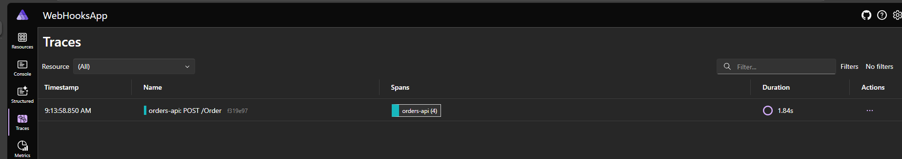

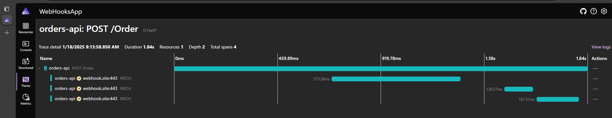

- After implementiing Channel and Backgroundjob to process the Webhook dispatch, here are the traces in the Aspire dashboard. 
    - Here the Order creation post endpoint is in its own separate span and executed quickly.
    - Below spans are the webhook dispatcher process for each subscriptions.

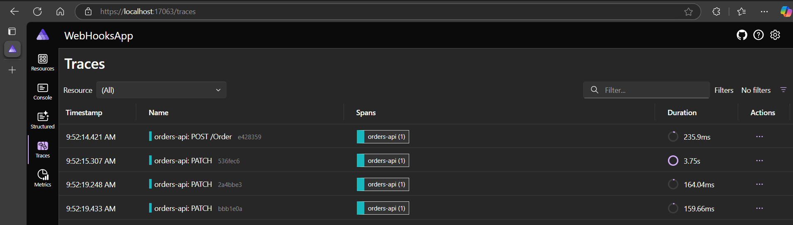

## Added more OpenTelemetry traces to log the activity along with base Create Order

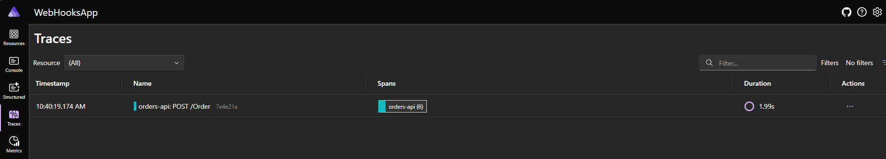

- in the Process Webhook, its processing the 3 Subscriptions I have in database.

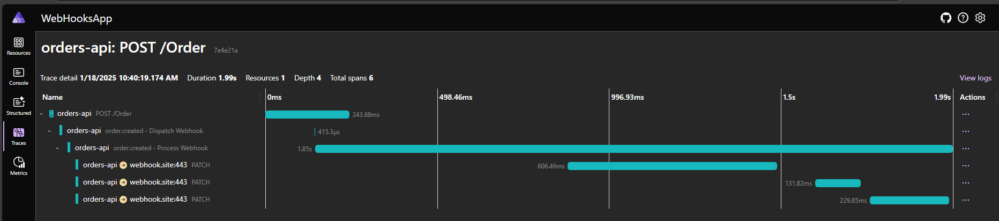
