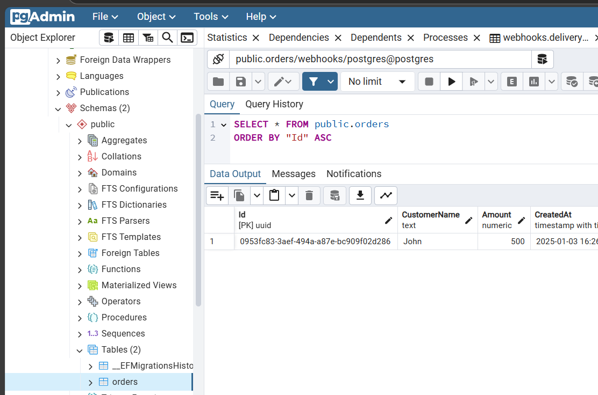

# Webhooks system in .Net using Postgres in .Net Aspire

## Create Subscription with Webhook Url

## Create Order

## Adding Persistance storage using Postgres 

**.Net Aspire Resources**

**Created tables with Schema**

- Access the PgAdmin tool using the resource in .Net Aspire

